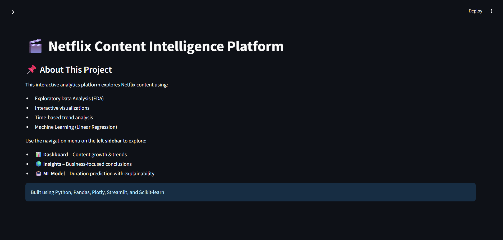
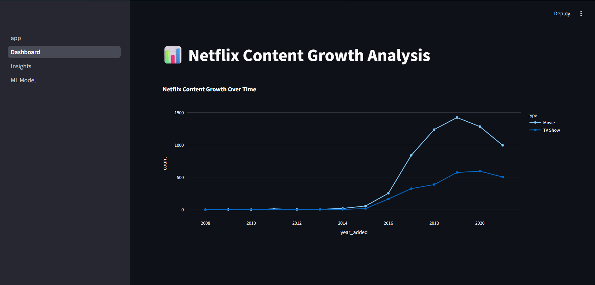
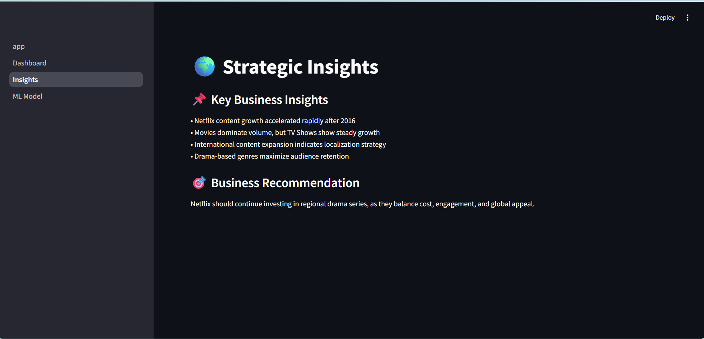
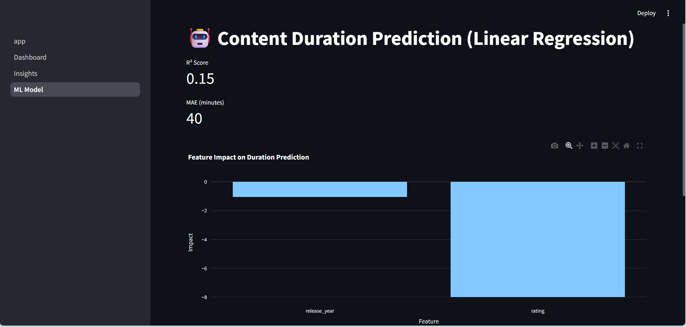
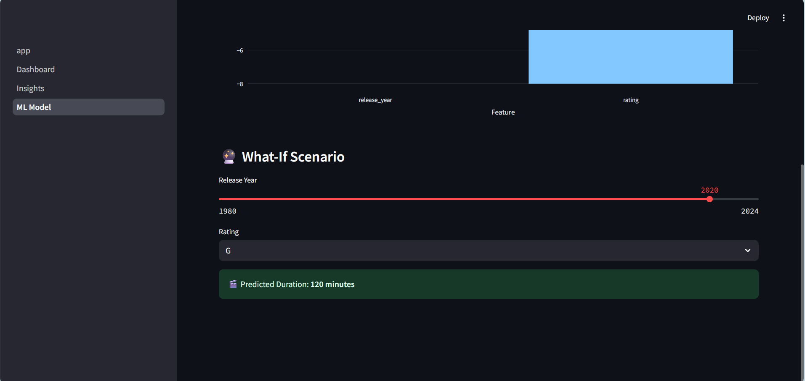

# 🎬 Netflix Content Analytics & ML Dashboard

An end-to-end data analytics and machine learning project analyzing Netflix content using
EDA, feature engineering, interactive visualizations, and predictive modeling.

Built with **Streamlit** to provide a clean, interactive dashboard experience.

---

## 🚀 Features

- 📊 Interactive Streamlit dashboard
- 🎞️ Movies vs TV Shows analysis
- 🌍 Country-wise & Genre-wise insights
- 📈 Year-wise content growth trends
- 🤖 Linear Regression model for duration prediction
- 🧠 Feature engineering on real-world data
- 🧪 Multi-page Streamlit application

---

## 🛠 Tech Stack

- **Python**
- **Pandas, NumPy**
- **Matplotlib, Seaborn**
- **Streamlit**
- **Scikit-learn**
- **VS Code**

---

## 📂 Project Structure

```

Netflix-EDA-Feature-Engineering/
│
├── app.py # Main Streamlit app
├── pages/ # Multi-page Streamlit views
├── notebooks/ # EDA & feature engineering notebooks
├── data/ # Netflix dataset
├── visuals/ # Saved plots & screenshots
├── insights.md # Business insights
├── requirements.txt
└── README.md

```
---


## 📊 Machine Learning

- Model Used: **Linear Regression**
- Target: Content Duration
- Metrics:
  - R² Score
  - Mean Absolute Error (MAE)

The model demonstrates explainability and baseline predictive performance.
```

```
## ▶️ How to Run Locally

```bash
pip install -r requirements.txt
streamlit run app.py

```

---

📌 Dataset

Netflix Movies and TV Shows dataset (public dataset).

---


## 📸 Dashboard Preview

### 🏠 Home Page


### 📊 Dashboard


### 📈 Insights


### 🤖 Machine Learning



